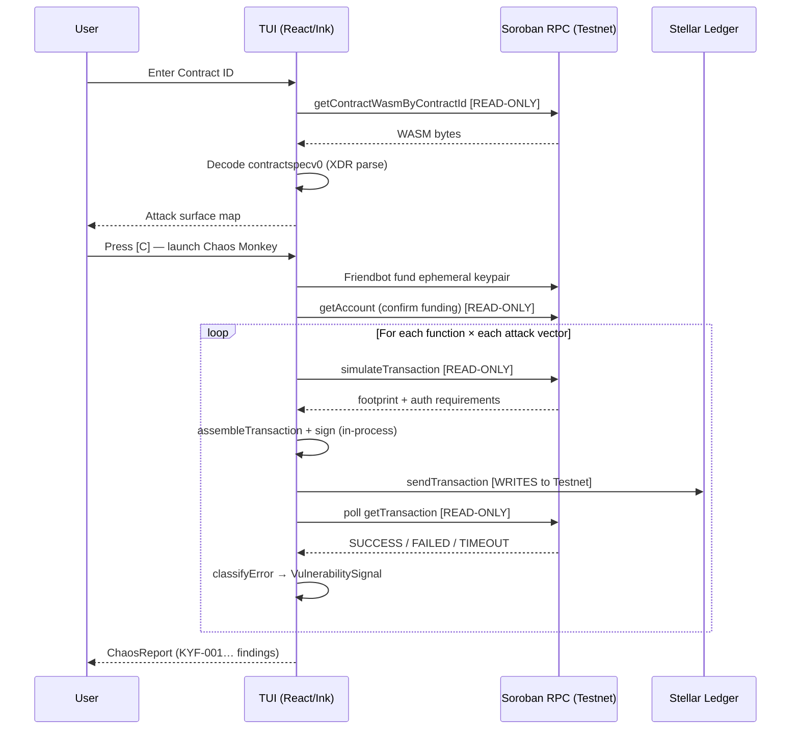

# Architecture

## Overview

Kuyfi is a Node.js terminal application. The TUI layer (React + Ink) runs in the foreground process and drives all Soroban RPC calls directly — there is no backend server or daemon.

```
User keyboard input
       │
       ▼
┌─────────────────────────────┐
│  TUI — React + Ink          │
│  source/cli.tsx             │  Entry point; manages terminal resize
│  source/app.tsx             │  SPA-style state router (menu/scanner/chaos/logs/about)
└──────────┬──────────────────┘
           │
           ├─── OSINT Scanner ──────────────────────────────────────────────────┐
           │    (source/app.tsx — ScannerView)                                  │
           │                                                                    │
           │    1. getContractWasmByContractId(contractId)   READ-ONLY RPC      │
           │    2. WebAssembly.compile(wasmBytes)            in-process         │
           │    3. customSections("contractspecv0")          in-process         │
           │    4. Alignment-tolerant XDR parse loop         in-process         │
           │    5. Build UDT registry + function list        in-process         │
           │    6. Render attack surface map                 terminal           │
           │                                                                    │
           └─── Chaos Monkey ───────────────────────────────────────────────────┘
                (source/modules/chaos_monkey/)

                ┌─ keypair_factory.ts ─┐
                │ Generate keypair     │  ← Friendbot HTTP (testnet only)
                │ Fund via Friendbot   │
                │ Poll account confirm │  ← getAccount (READ-ONLY)
                └──────────┬───────────┘
                           │
                ┌─ index.ts (orchestrator) ─┐
                │ For each function:         │
                │   fuzzMathVectors()        │  ← fuzzer_math.ts
                │   fuzzAccessVectors()      │  ← fuzzer_access.ts (admin only)
                └──────────┬────────────────┘
                           │
                ┌─ router.ts (invokeContract) ─┐
                │ getAccount                   │  READ-ONLY
                │ TransactionBuilder.build()   │  in-process
                │ simulateTransaction()        │  READ-ONLY (footprint + auth)
                │ assembleTransaction()        │  in-process
                │ sign with ephemeral keypair  │  in-process
                │ sendTransaction()            │  ← WRITES to Testnet
                │ poll getTransaction()        │  READ-ONLY
                └──────────┬────────────────────┘
                           │
                ┌─ result_parser.ts ─┐
                │ classifyError()    │  error taxonomy → VulnerabilitySignal
                │ parseInvokeResult()│  signal + severity
                └──────────┬─────────┘
                           │
                ┌─ reporter.ts ─────┐
                │ buildReport()     │  aggregate → ChaosReport
                │ formatReport()    │  terminal string
                └───────────────────┘
```

## Components

### `source/cli.tsx` — Entry point

Renders the `TerminalManager` wrapper, which listens for `process.stdout` resize events and forces a React re-render to prevent the visual "cascade" artifact that Ink otherwise leaves on terminal resize. Captures the Ink render instance to call `instance.clear()` before re-render.

### `source/app.tsx` — TUI router + views

State-based SPA router with four views: `menu`, `scanner`, `chaos`, `logs`, `about`. Keyboard input is handled with Ink's `useInput` hook, scoped per-view via the `isActive` parameter. The Scanner view passes its scanned functions and UDT registry to the Chaos Monkey view via lifted state in the `App` root.

### `source/modules/chaos_monkey/keypair_factory.ts`

Generates a random `Keypair`, requests funding from the Stellar Friendbot faucet (Testnet only), and polls `getAccount` until the account appears on-chain before returning. **No keypair is persisted to disk.**

### `source/modules/chaos_monkey/fuzzer_math.ts` — Math boundary fuzzer

Implements one-variable-at-a-time fuzzing. For each parametrized function:
- All parameters receive a type-correct **baseline** value (zero equivalent for their type).
- One parameter at a time is replaced with an **attack value** (boundary or edge case).
- Each combination is submitted as a real on-chain transaction via `router.ts`.

Attack values are generated by `type_gen.ts` based on the XDR `ScSpecTypeDef` of each parameter.

### `source/modules/chaos_monkey/fuzzer_access.ts` — Access control fuzzer

Runs three attack vectors against functions whose names match admin patterns (`initialize`, `pause`, `upgrade`, `set_admin`, etc.):

| Vector | Description |
|---|---|
| `UNAUTHORIZED_CALL` | Call the admin function from the random ephemeral keypair |
| `REINIT_ATTACK` | Call `initialize`/`init`/`setup` on an already-deployed contract |
| `SELF_CALL_ATTACK` | Call `set_admin`/`transfer_admin` with the attacker's own address as the new admin |

All arguments use type-correct baseline values from `type_gen.ts` to ensure failures occur at the auth level, not at argument parsing.

### `source/modules/chaos_monkey/router.ts` — Transaction executor

Executes one Soroban contract call end-to-end. The flow is:

```
getAccount → TransactionBuilder.build → simulateTransaction
  → (if simulation error) return SIMULATION_FAIL
  → assembleTransaction → sign → sendTransaction
  → poll getTransaction every 1 s, up to 20 attempts
  → (if not confirmed) return TIMEOUT
```

Never throws — all errors are captured and returned as a typed `InvokeResult`.

### `source/modules/chaos_monkey/result_parser.ts` — Error taxonomy

Maps raw `InvokeResult` to a `ParsedResult` with a `VulnerabilitySignal` and `Severity`:

| Signal | Severity (admin fn) | Severity (other fn) | Trigger |
|---|---|---|---|
| `POTENTIAL_VULN` | CRITICAL | HIGH | WASM panic on type-correct input; or access vector call succeeded |
| `UNEXPECTED_ERROR` | MEDIUM | MEDIUM | Storage reached before auth; or unclassified error |
| `PRECONDITION_FAIL` | LOW | LOW | TX_FAILED (simulation passed; on-chain state issue) |
| `TIMEOUT` | LOW | LOW | Not confirmed within 20 polls |
| `SIMULATION_FAIL` | LOW | LOW | Simulation returned an error |
| `SECURE` | INFO | INFO | Expected auth/contract/object/context rejection; or graceful success |

### `source/modules/chaos_monkey/reporter.ts` — Report builder

Aggregates all `FuzzResult` items into a `ChaosReport`. Filters SECURE and PRECONDITION_FAIL results out of the findings list (they go to the summary counters only). Assigns sequential IDs (`KYF-001`, `KYF-002`, …) and sorts by severity (CRITICAL first).

### `source/modules/chaos_monkey/type_gen.ts` — Type-aware value generator

Generates `ScVal` values for arbitrary `ScSpecTypeDef` types, including recursive types (Vec, Map, Option) and UDT structs (via the registry built from `scSpecEntryUdtStructV0` entries). Used by both fuzzers to produce type-correct baselines and attack vectors.

### `src/kuyfi_client/` — Auto-generated Soroban bindings

A separate npm package generated by the Soroban CLI for a specific contract. The app imports it at `../src/kuyfi_client/dist/index.js`. This client must be built separately (`npm install && npm run build` inside `src/kuyfi_client/`).

---

## Data flow diagram



---

## Security notes

- **No private key storage.** Ephemeral keypairs are generated in memory and never written to disk or logged.
- **Testnet only.** The RPC endpoint is hardcoded to `https://soroban-testnet.stellar.org`. Mainnet support is not present.
- **Read-only phase first.** The OSINT Scanner issues no transactions — only `getContractWasmByContractId`.
- **Real transactions.** The Chaos Monkey submits real signed transactions to Stellar Testnet. Each vector costs a small XLM fee paid from the Friendbot-funded ephemeral account.
