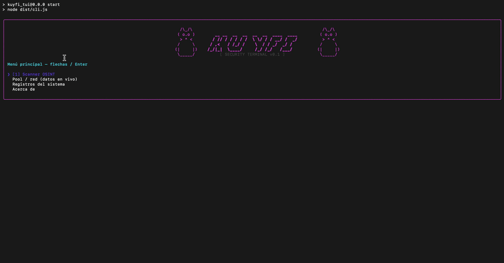

```text
      /\_/\               __ __  __  __  __  __  ____  ____               /\_/\
     ( o.o )             / // / / / / /  \ \/ / / __/ /  _/              ( o.o )
      > ^ <             / ,<   / /_/ /    \  / / _/  _/ /                 > ^ <
     /     \           /_/|_|  \____/     /_/ /_/   /___/                /     \
    (|     |)                                                           (|     |)
     \_____/                  [ CORE SECURITY MODULE ]                   \_____/
```

# Kuyfi Core — Security Terminal (TUI)

Kuyfi is the first black-box smart contract security scanner native to Soroban — no source code required.

Most security tools (Veridise, Certora) require the original Rust source code. Kuyfi works directly on deployed contracts by extracting and decoding WASM bytecode on-chain.

Think of Kuyfi as an **audit readiness tool**: developers run it before paying for a formal audit so they reach Veridise or Ottersec without obvious, surface-level vulnerabilities.


## Live Demo



> Scanning a live AMM contract on Stellar Testnet — no source code needed.

_Add `./docs/demo.gif` manually; the path is reserved for the screen recording._

## Current Capabilities (Phase 1: OSINT Scanner)

The OSINT module maps the attack surface using purely on-chain data:

- **WASM extraction:** Pulls the compiled `.wasm` binary for any valid Contract ID via Stellar RPC.

- **XDR telemetry:** Decodes the `contractspecv0` section from the WASM buffer (including alignment-tolerant parsing where the stream has no explicit delimiters).

- **Surface mapping:** Renders contract endpoints in the terminal—function names, inputs, and outputs in a readable layout.

## Architecture and Technical Concepts

This project separates terminal UI from chain access:

- **Visual engine (React + Ink):** React state and lifecycles; Ink renders in the terminal.

- **Web3 connectivity:** Auto-generated Soroban bindings and `stellar-sdk` for RPC against Stellar Testnet.

- **SPA-style navigation:** State-based routing between SecOps modules (e.g. OSINT Scanner, Chaos Monkey) without restarting the Node process.

- **Strict typing:** TypeScript for safer handling of RPC and decoded data before render.

## How Kuyfi fits the Soroban ecosystem

The **Soroban Audit Bank** (Veridise, Ottersec, CoinFabrik, and peers) delivers expert human audits—but those engagements typically expect source code and budget.

Kuyfi is the **missing layer before formal audits**: automated, **black-box**, and **CLI-native**, so you can profile a live contract the same way you would probe a closed binary.

**Suggested workflow:** run Kuyfi → fix obvious issues and shrink the attack surface → submit to the Audit Bank with a cleaner baseline and fewer trivial findings.

## Roadmap

- ✅ **Phase 1 — OSINT Scanner:** WASM extraction, XDR decoding, attack surface mapping **(COMPLETE)**

- 🔨 **Phase 2 — Chaos Monkey:** Automated fuzzer. Math overflow injection, authorization bypass simulation, boundary value attacks against live Testnet contracts **(IN PROGRESS)**

- 📋 **Phase 3 — Audit Reports:** Export findings as structured JSON/PDF for audit firms

## ⚙️ Prerequisites

To run this terminal locally you need:

- Node.js (v18 or higher recommended)

- npm (Node Package Manager)

- Internet access for RPC to Stellar Testnet

## Usage and Deployment Instructions

### 1. Installation

Clone the repository and install dependencies:

```bash
git clone https://github.com/alex0tico/kuyfi_tui.git
cd kuyfi_tui
npm install
```

### 2. Web3 Client Configuration

Build the auto-generated Soroban client so Node can load the bindings:

```bash
cd src/kuyfi_client
npm install
npm run build
cd ../..
```

### 3. Running the Terminal

From the project root (`kuyfi_tui`):

```bash
npm run dev
# In another terminal tab:
npm start
```

Press `Esc` to return to the menu, or `Ctrl + C` to exit.
