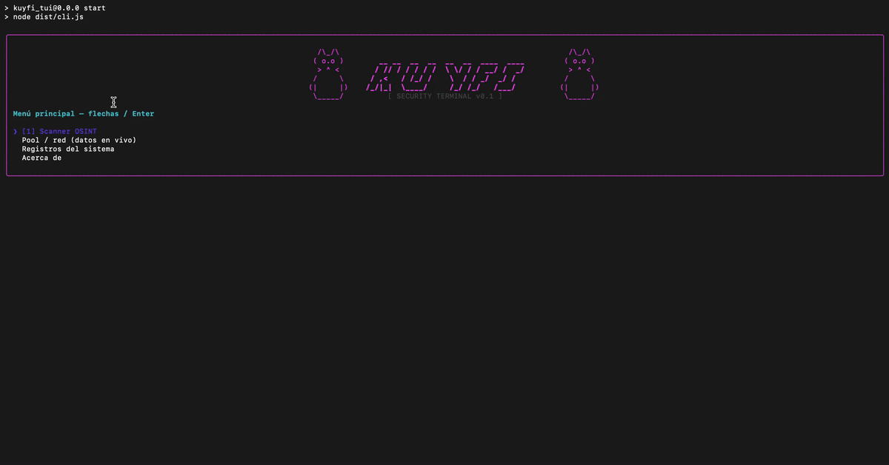

```text
      /\_/\               __ __  __  __  __  __  ____  ____               /\_/\
     ( o.o )             / // / / / / /  \ \/ / / __/ /  _/              ( o.o )
      > ^ <             / ,<   / /_/ /    \  / / _/  _/ /                 > ^ <
     /     \           /_/|_|  \____/     /_/ /_/   /___/                /     \
    (|     |)                                                           (|     |)
     \_____/                  [ CORE SECURITY MODULE ]                   \_____/
```

# Kuyfi Core — Security Terminal (TUI)

Kuyfi is the first black-box smart contract security scanner native to Soroban — no source code required.

Most security tools (Veridise, Certora) require the original Rust source code. Kuyfi works directly on deployed contracts by extracting and decoding WASM bytecode on-chain.

Think of Kuyfi as an **audit readiness tool**: developers run it before paying for a formal audit so they reach Veridise or Ottersec without obvious, surface-level vulnerabilities.


## Live Demo

Screen recording (GIF): [`docs/demo.gif`](./docs/demo.gif)



> Scanning a live AMM contract on Stellar Testnet — no source code needed.

## Current Capabilities

### Phase 1: OSINT Scanner (Stable)

The OSINT module maps the attack surface using purely on-chain data:

- **WASM extraction:** Pulls the compiled `.wasm` binary for any valid Contract ID via Stellar RPC.

- **XDR telemetry:** Decodes the `contractspecv0` section from the WASM buffer (including alignment-tolerant parsing where the stream has no explicit delimiters).

- **Surface mapping:** Renders contract endpoints in the terminal — function names, inputs, and outputs in a readable layout.

### Phase 2: Chaos Monkey (Beta — In Testing)

The Chaos Monkey module is fully developed and integrated into the TUI as a first-class menu item. It is currently in the testing phase against real DeFi protocol contracts deployed on Stellar Testnet and is not yet stable for production use.

**How it works:**

1. **Ephemeral keypair:** Generates a random Stellar keypair, funds it via Friendbot, and polls for on-chain account confirmation before starting any attack.

2. **Math boundary attacks:** For each function with at least one parameter, submits four i128 attack inputs as `ScVal`: `ZERO_ATTACK` (0), `MAX_VALUE_ATTACK` (i128::MAX), `NEGATIVE_ATTACK` (-1 in two's complement), and `MIN_BOUNDARY_ATTACK` (smallest positive value). These are borderline-valid inputs a secure contract should handle gracefully — unexpected reverts are flagged as `POTENTIAL_VULN`.

3. **Access control attacks:** For functions whose names match admin patterns (`initialize`, `pause`, `unpause`, `upgrade`, `set_admin`, `transfer_admin`, and similar), the module runs up to three vectors: `UNAUTHORIZED_CALL` (invoke from the random non-admin keypair), `REINIT_ATTACK` (re-call initialization on an already-deployed contract), and `SELF_CALL_ATTACK` (attempt to promote the attacker's own address as admin). These attacks are expected to be rejected by a secure contract — if any succeeds, it is reported as `POTENTIAL_VULN`.

4. **Real on-chain transactions:** Every vector builds a transaction with `TransactionBuilder`, calls `simulateTransaction` to obtain the execution footprint, assembles the prepared transaction, signs it, and broadcasts it with `sendTransaction`. Results are polled every second for up to 20 seconds per transaction.

5. **Findings and severity:** Results are classified as `SECURE`, `POTENTIAL_VULN`, `UNEXPECTED_ERROR`, `TIMEOUT`, or `SIMULATION_FAIL`. `POTENTIAL_VULN` on admin-gated functions escalates to CRITICAL; on other functions it is HIGH. Each non-secure finding is assigned a sequential ID (`KYF-001`, `KYF-002`, ...) and the final report is sorted by severity.

Chaos Monkey is accessible from the main menu (item 2) and also directly from the OSINT Scanner results screen via `[C]`, which loads the same target contract automatically.

## Architecture and Technical Concepts

This project separates terminal UI from chain access:

- **Visual engine (React + Ink):** React state and lifecycles; Ink renders in the terminal.

- **Web3 connectivity:** Auto-generated Soroban bindings and `stellar-sdk` for RPC against Stellar Testnet.

- **SPA-style navigation:** State-based routing between four SecOps modules — OSINT Scanner, Chaos Monkey, System Logs, and About — without restarting the Node process.

- **Strict typing:** TypeScript for safer handling of RPC and decoded data before render.

## How Kuyfi fits the Soroban ecosystem

The **Soroban Audit Bank** (Veridise, Ottersec, CoinFabrik, and peers) delivers expert human audits — but those engagements typically expect source code and budget.

Kuyfi is the **missing layer before formal audits**: automated, **black-box**, and **CLI-native**, so you can profile a live contract the same way you would probe a closed binary.

**Suggested workflow:** run Kuyfi -> fix obvious issues and shrink the attack surface -> submit to the Audit Bank with a cleaner baseline and fewer trivial findings.

## Roadmap

- **Phase 1 — OSINT Scanner:** WASM extraction, XDR decoding, attack surface mapping — **COMPLETE**

- **Phase 2 — Chaos Monkey:** Math overflow injection, authorization bypass simulation, boundary value attacks against live Testnet contracts — **DEVELOPED / IN TESTING**

- **Phase 3 — Audit Reports:** Export findings as structured JSON/PDF for audit firms — **PLANNED**

## Prerequisites

To run this terminal locally you need:

- Node.js (v18 or higher recommended)

- npm (Node Package Manager)

- Internet access for RPC to Stellar Testnet

## Usage and Deployment Instructions

### 1. Installation

Clone the repository and install dependencies:

```bash
git clone https://github.com/alex0tico/kuyfi_tui.git
cd kuyfi_tui
npm install
```

### 2. Web3 Client Configuration

Build the auto-generated Soroban client so Node can load the bindings:

```bash
cd src/kuyfi_client
npm install
npm run build
cd ../..
```

### 3. Running the Terminal

From the project root (`kuyfi_tui`):

```bash
npm run dev
# In another terminal tab:
npm start
```

Press `Esc` to return to the menu, or `Ctrl + C` to exit.
